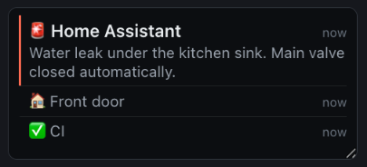
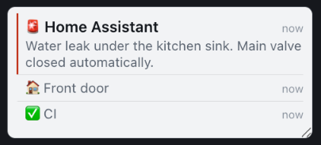

# ntfy for codriver

Your phone's notifications, on the map screen.

This is a small web page that [codriver](https://codriver.io) embeds beside the
map in a Tesla's browser. It subscribes to one [ntfy](https://ntfy.sh) topic and
shows what arrives — newest first, big enough to read at a glance, quiet enough
to ignore.

It is also the **reference implementation** of a codriver widget app. If you are
building your own, this repo is meant to be read start to finish and copied:
`public/index.html` is one self-contained file, and its comments explain the
reasoning behind every decision that a car imposes on you.

| Dark | Light |
| --- | --- |
|  |  |

<!-- Both captured from the dev harness at the real slot size, 300x130 CSS px.
     TODO: replace with a capture of the widget in an actual car. -->

---

## What codriver is, in one paragraph

codriver is a driving overlay that runs in the Tesla in-car browser: a 3D map
with live traffic alerts and turn-by-turn navigation. Alongside the map it
reserves one or two small **widget slots**, each of which loads a third-party
page in a sandboxed iframe. Those pages are "codriver apps". This is one of
them, and it is the first.

## What this app does

- Subscribes to a single ntfy topic on [ntfy.sh](https://ntfy.sh) or on your own
  self-hosted ntfy server.
- Shows the newest notification with its title, body, priority and tags, plus
  the two or three before it as one dim line each.
- Relative timestamps ("2 min"), because a clock time is arithmetic and a glance
  is not.
- Reconnects by itself when the car drives through a tunnel, and says so calmly
  while it does.
- Tells you what to fix when something is actually wrong — a rejected token, a
  topic name that ntfy will not accept — instead of showing a spinner forever.

## What it deliberately does not do

- No sound, no flashing, no animation of any kind. It shares a GPU with a 3D map
  on an eight-year-old Intel chip, and it shares a windscreen with traffic.
- No click-through, no attachments, no action buttons. ntfy supports them; a
  driving screen is the wrong place for them. Reply on your phone.
- No account, no server of its own, no analytics. The only host it ever contacts
  is the ntfy server you configured.

---

## For users: installing it

1. **Install ntfy on your phone** — [Android](https://ntfy.sh/docs/subscribe/phone/)
   or [iOS](https://ntfy.sh/docs/subscribe/phone/) — and subscribe to a topic.
   A topic is just a name. **Pick something nobody could guess** (e.g.
   `alerts-h7q2v9xk3m`, not `alerts`): on a public ntfy server, anyone who knows
   the topic name can read it and publish to it.
2. **Point your notification sources at that topic.** Anything that can make an
   HTTP request can publish to it — Home Assistant, a NAS, a CI job, an iOS
   Shortcut, `curl`:
   ```
   curl -H "Title: Front door" -H "Tags: house" \
        -d "Motion on the driveway camera" \
        ntfy.sh/alerts-h7q2v9xk3m
   ```
3. **In codriver, go to [codriver.io/account](https://codriver.io/account) →
   Apps → ntfy**, and fill in:
   - **ntfy server** — `https://ntfy.sh`, or your own server's URL if you
     self-host.
   - **Topic** — the topic name from step 1.
   - **Access token** — only if the topic is protected. Create one under your
     ntfy account settings; it looks like `tk_…`.
4. That is it. Next time you open codriver in the car, the widget is in the slot
   and notifications show up in about a second.

### Troubleshooting

| What you see | What it means |
| --- | --- |
| **Connecting… / Reconnecting…** (amber dot) | The car has no usable connection, or the server is unreachable. It retries on its own and recovers; nothing to do. |
| **No notifications yet** | Connected fine, nothing has been published in the last few hours. |
| **Access token rejected** | The token is wrong, or it has no *read* access to that topic. Fix it in Apps. |
| **This topic needs a token** | The topic is protected and you have not configured a token. |
| **Topic name is not valid** | ntfy topics allow only letters, numbers, `-` and `_`, up to 64 characters. |
| **Server did not recognise that topic** | Usually a typo in the server URL. |

---

## For developers

### Run it locally

```bash
git clone https://github.com/codriver-io/codriver-app-ntfy
cd codriver-app-ntfy
npm run serve          # python3 -m http.server 8790 -d public
open http://localhost:8790/dev.html
```

`public/dev.html` is a **local dev harness that fakes the codriver host**. It
embeds `index.html` in the same sandboxed iframe the real host uses, and posts
the same `context` message — on iframe load, again when the widget posts
`ready`, on any theme/units/uiSize change, and on slot resize, exactly like
production. You can:

- set the server, topic and token, and switch theme / units / uiSize live;
- drag the corner of the slot to resize it and watch the layout re-fit;
- hit **Publish a test message** to POST to your topic from the page, so a real
  message travels the real SSE stream (the same thing as
  `curl -d "test" ntfy.sh/<your-topic>`).

You never need a codriver account or the driver app to work on this.

`index.html` itself has no dev mode and reads no query parameters: config
arrives only over `postMessage`, in development and in production alike. That is
a deliberate property, not an oversight — see *Security notes*.

### Deploy it

Any static host will do. This one is on Cloudflare Pages:

```bash
npm install            # wrangler is the only dependency
npx wrangler login     # once
npm run deploy         # → https://ntfy-client-codriver.pages.dev
```

The only server-side requirement is that the page must be **framable**: no
`X-Frame-Options`, and no `frame-ancestors` that excludes the codriver origin.
Being embedded is the entire point.

### Submit it to the marketplace

`codriver-app.json` in this repo is the manifest, and it is a working example of
every field:

```jsonc
{
  "name": "ntfy",                                 // <= 80 chars
  "description": "...",                           // <= 255 chars
  "install_instructions": "...",                  // <= 512 chars
  "integration_types": ["widget", "notifications"],
  "widget_url": "https://ntfy-client-codriver.pages.dev",
  "website_url": "...",
  "docs_url": "...",
  "cost_model": "free",
  "version": "1.0.0",
  "config_schema": { "fields": [ /* see below */ ] }
}
```

#### The `config_schema` this app declares

`config_schema` is how the marketplace builds the settings form the user fills
in at *codriver.io/account → Apps*. Whatever they enter is handed to the widget
inside the `context` message — the widget never renders a settings UI of its
own, which is what keeps configuration out of the car.

```json
{ "fields": [
  { "key": "server", "label": "ntfy server", "type": "url", "required": true,
    "default": "https://ntfy.sh", "help": "Use your own server's URL if you self-host." },
  { "key": "topic", "label": "Topic", "type": "string", "required": true, "maxLength": 64,
    "help": "The topic you publish to from your phone." },
  { "key": "token", "label": "Access token", "type": "string", "required": false, "secret": true,
    "help": "Only needed for protected topics." } ]}
```

Two things worth knowing about `secret: true`: the value **is** delivered to your
page in full (the flag governs masking in the account form and redaction in host
logs, not delivery), and fields the user leaves blank are **omitted** from
`config` rather than sent as `null` — so `if (config.token)` is the right check.

---

## The SDK contract

The host and the widget speak `postMessage` and nothing else.

### Host → widget: `context`

Posted at the widget's exact origin:

```js
{ codriver: 1, type: 'context',
  theme: 'dark' | 'light',
  units: 'metric' | 'imperial',
  uiSize: 1..10,                 // density preference, 6 = default
  slot: 1 | 2,
  size: { w, h },                // the box you were given, CSS px
  device: 'tesla' | 'other',
  config: { /* your config_schema, filled in by the user */ } }
```

It is sent **on iframe load, again whenever you post `ready`, on any
theme/units/uiSize change, and whenever the slot's rendered size changes.**

The single most important consequence: **`context` is a state snapshot, not an
init event.** It will arrive many times, and most of those times nothing you
care about has changed. Re-render freely; re-subscribe only when the fields you
actually connect with have changed. In this app that is
[`applyContext()`](public/index.html) — it diffs `server`/`topic`/`token` and
calls `resubscribe()` only on a real change. A widget that reconnects on every
`context` will drop its stream every time the driver resizes a panel.

### Widget → host: `ready`

```js
window.parent.postMessage({ codriver: 1, type: 'ready' }, '*');
```

Exactly this, once, when you have loaded. It is the only message you may send
with `targetOrigin: '*'`, and it is safe only because it carries no data — at
that point you have not been told who your parent is, so there is no origin to
target.

### Validating what arrives

```js
if (!d || d.codriver !== 1 || d.type !== 'context') return;   // ignore silently
```

An iframe receives messages from any window that can reach it, including
libraries that broadcast to `'*'`. Validate first, then **pin the origin**: this
app records `event.origin` from the first accepted `context` and rejects
anything from a different origin afterwards. codriver runs on production,
staging and localhost origins, so trust-on-first-use is the strongest check a
widget can make on its own.

### The sandbox and the lifecycle

The iframe is `sandbox="allow-scripts allow-same-origin allow-forms"`. No
popups, no top-level navigation, no downloads — do not try. You are cross-origin
from the host, so `localStorage` is your own origin's storage and works, but
wrap it in `try`/`catch` and treat it as a cache, never as the source of config.

Once mounted, your iframe stays loaded: when the driver opens the nav drawer the
host sets `hidden` on the frame rather than unmounting it, so a live connection
survives. Chromium **throttles timers in a hidden frame**, though, so anything
you scheduled may fire long after it was due. Recover on `visibilitychange`
rather than assuming your reconnect logic ran on time.

### Writing for the car

- Chromium ~140–148, `devicePixelRatio` ≈ 1.53. An MCU2 car is an Intel HD 505
  from 2017 holding ~25 fps *with the 3D map already running*. You share that
  GPU. No animation loops, no rAF, no timer you can do without.
- The slot is roughly **300×130 CSS px**. Design for that first, and use the
  `size` you are given rather than assuming it.
- No webfonts, no CDN, no analytics. Every request is one the car pays for on
  an LTE modem.
- The reader is driving. One thing prominent, everything else quiet. Nothing
  moves, nothing flashes, nothing makes a sound.

---

## How this app is built

One file, `public/index.html`, about 600 lines including comments. No build
step, no dependencies, no framework. Sections:

| Section | What lives there |
| --- | --- |
| Theme tokens / layout | Two hand-authored themes; a `data-theme` flip is the whole theme switch |
| Host SDK | `ready`, `context` validation, origin pinning, config diffing |
| Subscription | EventSource, keepalive watchdog, backoff, failure diagnosis |
| Message store | De-dup by id, 20-message cap, localStorage cache |
| Rendering | DOM construction, priority, tags, relative time, fit-trimming |

### Why EventSource (`/sse`) and not the JSON stream or WebSocket

ntfy offers three subscription transports — `/json` (newline-delimited JSON over
a never-ending response), `/sse` (Server-Sent Events) and `/ws` — and all three
deliver the same message objects. So the choice is purely about how they behave
when the connection is bad, which in a car is not the edge case but the normal
case.

**`/sse`, via `EventSource`, wins on reconnection.** The browser retries in
native code, forever, with no reconnect loop written by us. `/json` would need
`fetch` + a `ReadableStream` reader + a `TextDecoder` + a line splitter that
survives chunk boundaries + a hand-rolled retry policy: four more places for a
partial-frame bug that only appears on a lossy link, which is exactly the link
we have. `/ws` reconnects no better (WebSocket has no built-in retry either) and
adds an upgrade handshake that in-car and captive-portal network paths sometimes
mangle; plain HTTP goes wherever HTTP goes.

EventSource costs us four things, and the code handles each explicitly:

1. **No request headers.** So a protected topic authenticates with ntfy's
   `?auth=` query parameter instead, which carries the same value the
   `Authorization` header would, base64url-encoded **without padding** (ntfy's
   `server/server_auth.go` decodes it with `base64.RawURLEncoding`). It is
   slightly weaker than a header because it can land in the server's access log,
   so it is only added when a token is actually configured, and the resulting
   URL is never logged or displayed.
2. **No failure reason** — `EventSource` never surfaces a status code. So on a
   fatal error the app probes `GET {server}/{topic}/auth` with `fetch`, which
   *can* read the status and *can* send a real `Authorization` header. 401/403
   means the token is wrong, 404 means the address is, a network throw means the
   car simply has no signal. Three very different sentences on screen.
3. **No detection of a half-open connection**, where TCP is up as far as the
   browser is concerned but nothing flows. Nothing detects that, so a watchdog
   does: ntfy sends `event: keepalive` about every 45 s, and if 120 s pass with
   no frame of any kind the socket is treated as dead and replaced. (Named
   events do not fire `onmessage` — ntfy's server source says so in as many
   words — so `keepalive` needs its own listener.)
4. **No stop condition.** EventSource would retry a 401 until the heat death of
   the universe. On a fatal auth error this app stops, shows what to fix, and
   waits for a new `context` — which is how a corrected token arrives anyway.

For the failures EventSource *does* handle — the tunnel — the code deliberately
gets out of the way and lets the browser retry, and only takes over with its own
widening backoff after several failures in a row with no success in between.

Reconnects resume with `since=<last message id>`, so the gap an outage opened is
backfilled rather than lost; the first connect uses `since=3h` so the panel has
content the moment the driver gets in. Replays are therefore routine, and the
store de-duplicates by message id, which makes both paths safe.

## Security notes

- **Config never touches the URL.** Not a query parameter, not a hash. The topic
  and the token stay in memory, out of `document.title`, and out of every log.
  Anything in a URL is in history, in referrers, and in server logs.
- **The access token is never persisted.** The localStorage cache holds only
  message text the driver has already seen on that screen.
- **Notification content is untrusted text.** Anyone who knows a public topic
  name can publish to it, and this page runs with `allow-same-origin`. So every
  string from ntfy is written with `textContent` on nodes built by
  `createElement`. There is not one `innerHTML` in the file, and there must
  never be one.
- **Inbound messages are validated and the origin is pinned** on first accept.

## License

MIT — see [LICENSE](LICENSE).
